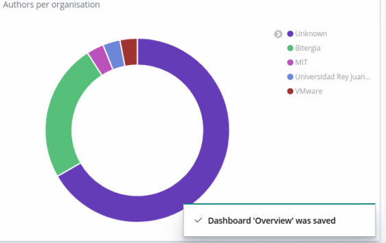

## Microtask-3

Create a new visualization using the data

### What kind of visualization is that ? :)

The visualization I came up with is about a pie chart which shows the number of authors per organisation/affiliation.
I used the <code>affiliation </code> index. The data source was <code>git</code>.

