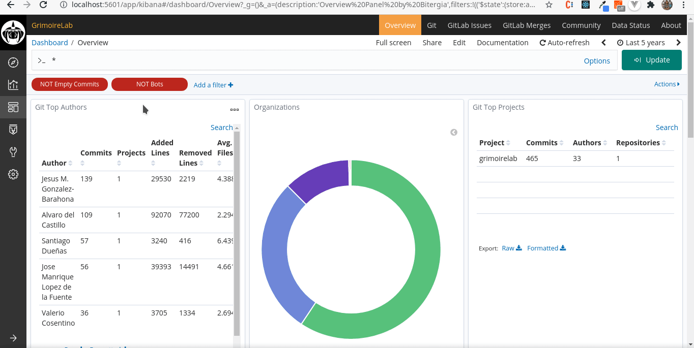
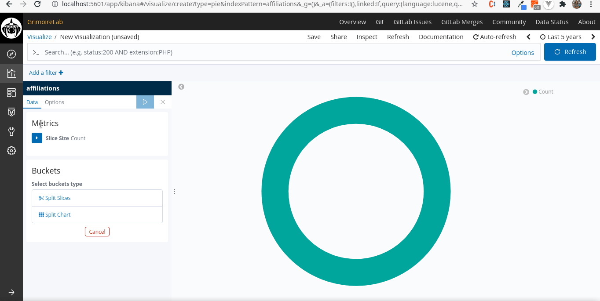
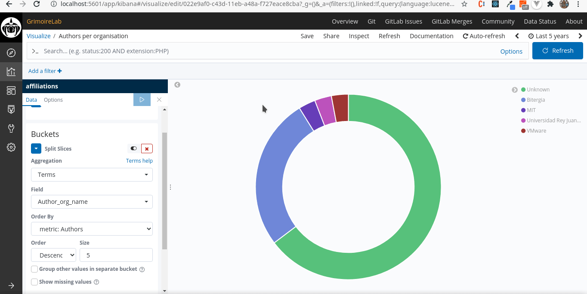

## Microtask-4

Write a markdown file describing your process of creating the new visualization, include an explanaition for eachstep, include screeshots, share the link to the markdown file

## Steps

1. Go to the dashboard and click on the Visualize icon on the side panel.
2. Click on the + sign which means we are going to create a new visualization
3. Now we select what kind of visualization we want (Data table, horizontal/vertical bar etc...)
4. Select an index. The latter is the data source from where we will fetch the data to plot the visualization.
5. Once the above is done, you can set the metrics and buckets. Depending on the visualization you choose, metrics refers to Y-axis and buckets to the X-axis. In case of a pie-chart, for example, it would be in terms of "Slice size" and "Split size"
6. After getting the visualization to work as needed, you can save it and name it.
7. In order to add the new visualization to the dashboard, first click on "Edit" on the headerbar of the dashboard, then "Add" and finally "Save".

## Demo

First we decide what kind of visualization we want to make. In this case, I'll go with a pie-chart with the number of authors per organisation. So the very first step is to choose our visualization and index.

Now we can start playing around with the metrics. I want to have the count of authors per organisation. Hence I will set the
slice size to the unique count of author_uuid (unique identifier for every author). You can see after setting that value we have 34 unique authors present. Now we need to seperate them according to their affiliation (organisation). We'll use the Term aggregation and the field, "Authors_org_name" as we only need the count of unique organisation names.

Once we've saved the visualization we can now import it onto our dashboard.

